# AI-Powered E-Commerce Analytics & Decision System

[](https://fastapi.tiangolo.com)
[](https://www.postgresql.org)
[](https://ai.google.dev)
[](https://vercel.com)
[](https://opensource.org/licenses/MIT)

An enterprise-grade business intelligence, predictive decision-support, and natural-language analytical platform built on the **Dunnhumby "The Complete Journey"** retail dataset. 

The platform integrates a production-structured **PostgreSQL** analytics warehouse, automated data cleaning and validation pipelines, a high-performance **FastAPI** backend, an enterprise glassmorphism analytics dashboard, and a guardrailed **Google Gemini AI** agent for natural-language SQL generation, anomaly detection, and executive management reporting.

---

## Table of Contents

- [Overview](#overview)
- [Dashboard Previews & Visualizations](#dashboard-previews--visualizations)
  - [1. Executive Overview](#1-executive-overview)
  - [2. Customer Intelligence](#2-customer-intelligence)
  - [3. Product & Sales Intelligence](#3-product--sales-intelligence)
  - [4. Marketing & Promotions](#4-marketing--promotions)
  - [5. AI Business Analyst & Decision Support](#5-ai-business-analyst--decision-support)
- [Key Features](#key-features)
- [Technology Stack](#technology-stack)
- [System Architecture](#system-architecture)
- [AI Analytical Workflow](#ai-analytical-workflow)
- [Database Pipeline & Data Lifecycle](#database-pipeline--data-lifecycle)
- [Repository Structure](#repository-structure)
- [Environment Configuration](#environment-configuration)
- [Local Setup & Installation](#local-setup--installation)
- [Dataset Handling & Ingestion](#dataset-handling--ingestion)
- [Technical Documentation Index](#technical-documentation-index)
- [Security & Governance](#security--governance)
- [Vercel Deployment Architecture](#vercel-deployment-architecture)
- [Project Status](#project-status)
- [Author & Acknowledgments](#author--acknowledgments)

---

## Overview

Modern retail and e-commerce enterprises generate millions of transactional data points across customer cohorts, product categories, and promotional campaigns. However, transforming raw transactional data into timely, strategic business decisions typically requires dedicated data engineering and analytics intervention.

**AI-Powered E-Commerce Analytics & Decision** bridges this gap through two operational workflows:

1. **User-Driven Natural Language Analysis:** Business decision-makers can ask complex analytical questions in plain English (e.g., *"Which customer segments generated the highest revenue drop last quarter?"* or *"What are our top 10 products by profit margin across suburban households?"*). The system translates questions into validated, read-only analytical SQL, executes them against PostgreSQL, and delivers structured answers with commercial recommendations.
2. **Proactive Business Intelligence:** The platform continuously scans underlying analytics tables to detect significant revenue anomalies, customer churn risks, category contractions, and promotional inefficiencies—automatically surfacing high-priority executive alerts and mitigation strategies.

---

## Dashboard Previews & Visualizations

The web application features a responsive, multi-page business intelligence workspace styled with a modern dark-mode glassmorphism design system.

### 1. Executive Overview

Provides top-level executive monitoring across total revenue, active households, unit volume, average basket value, transaction frequency, and high-level customer segment distributions.

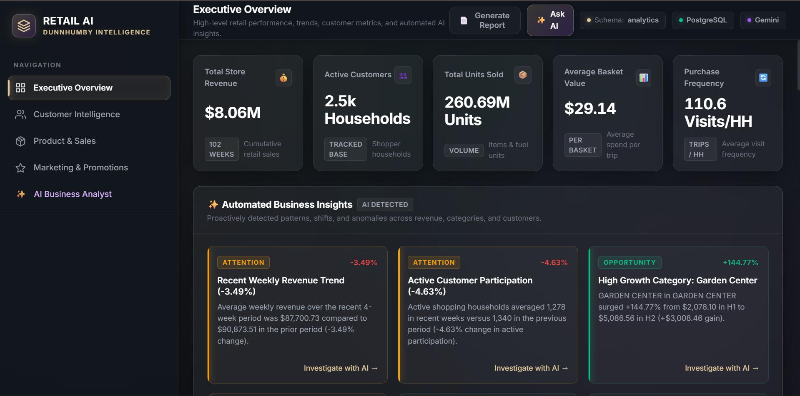
*Executive Overview: High-level business KPIs, automated business insights, and revenue momentum.*

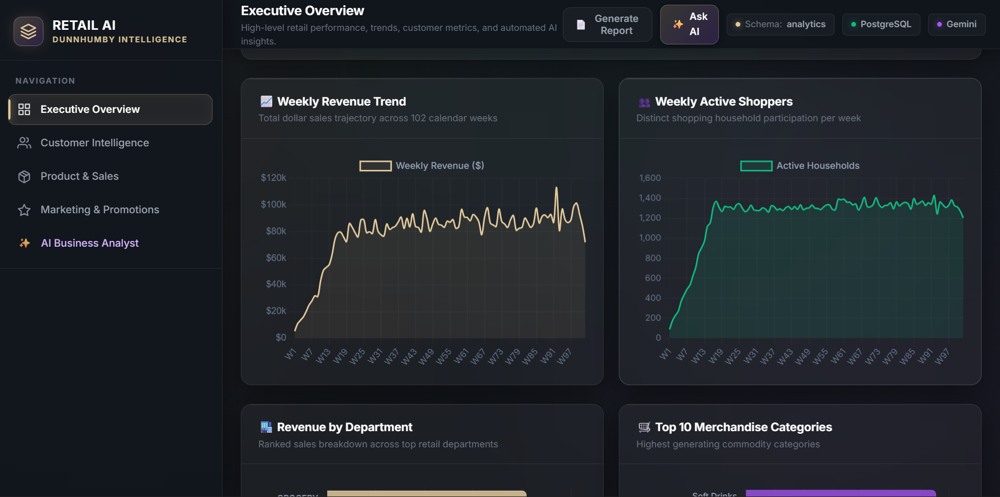
*Revenue & Volume Dynamics: Weekly revenue trends and sales volume trajectories.*

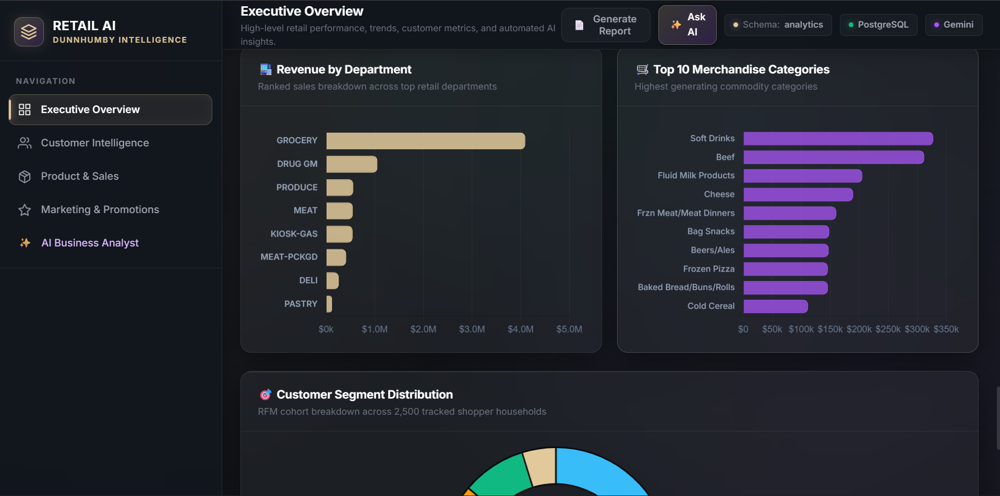
*Departmental & Category Breakdown: Department performance ranking and category share distribution.*

---

### 2. Customer Intelligence

Delivers deep customer analytics including RFM (Recency, Frequency, Monetary) segmentation, household spend distribution, lifecycle cohort dynamics, and automated customer retention playbooks.

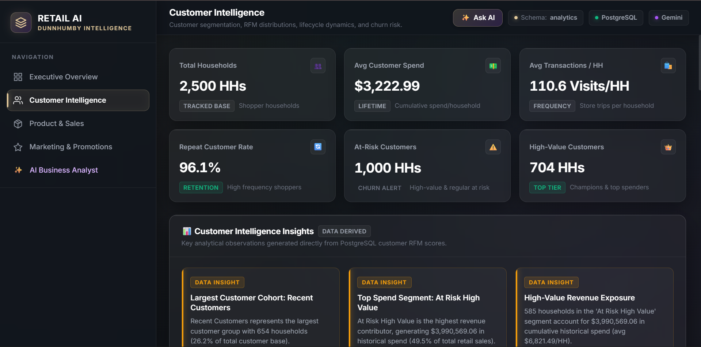
*Customer Intelligence Overview: Active customer KPIs, average household lifetime spend, and recency-frequency mapping.*

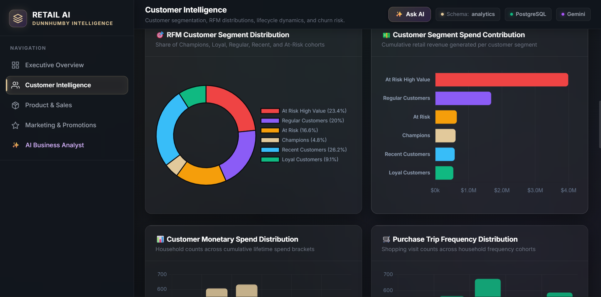
*RFM Customer Segmentation: Champions, Loyal Customers, At-Risk High-Value, and Inactive cohort revenue contribution.*

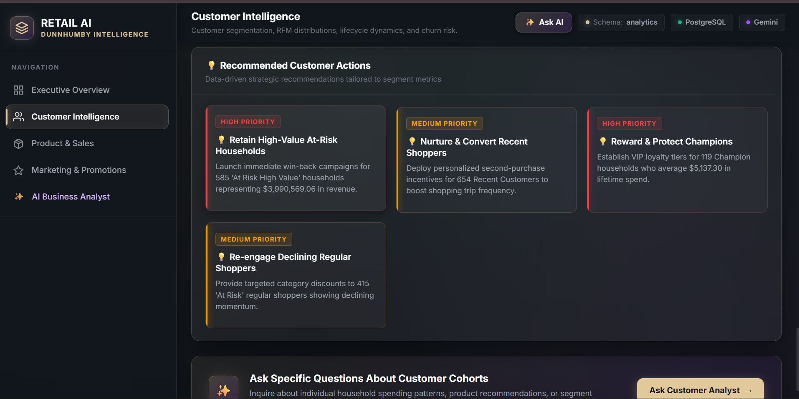
*Recommended Customer Actions: Automated strategic retention interventions tailored by customer risk profiles.*

---

### 3. Product & Sales Intelligence

Analyzes catalog performance, department sales velocity, unit movement, Pareto revenue concentration (80/20 rule), and granular SKU-level metrics.

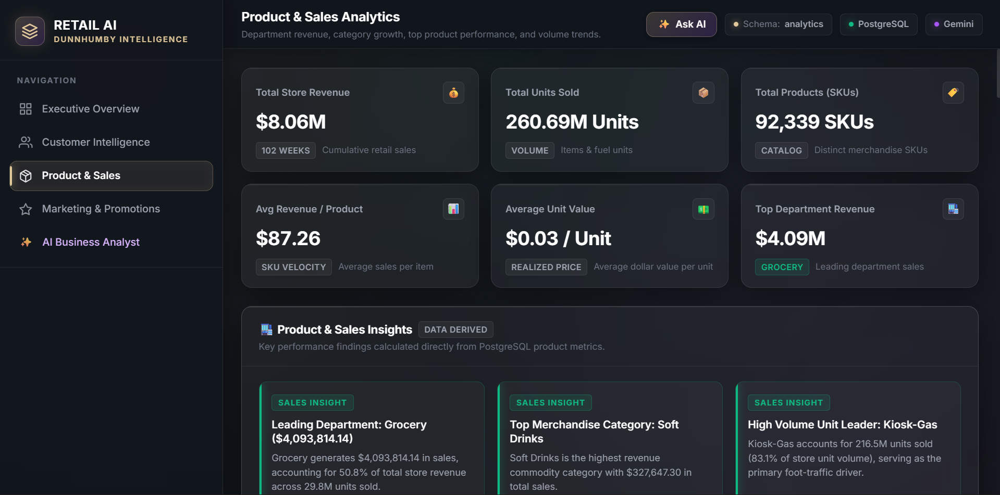
*Product & Sales Intelligence: Catalog KPIs, active product counts, top-performing categories, and margin distributions.*

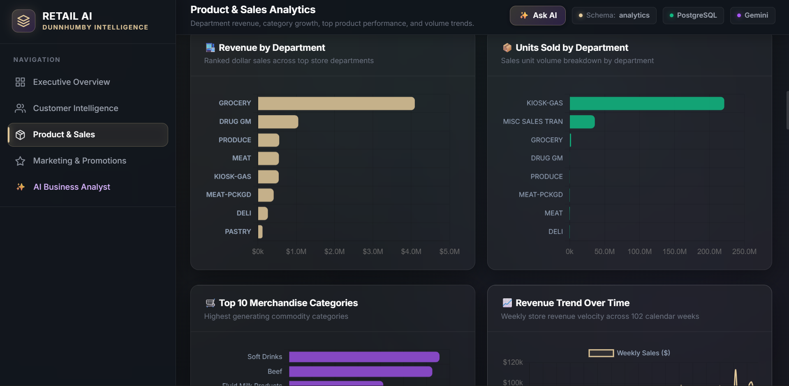
*Department & Category Sales Performance: Sales volume and revenue rankings across retail merchandise departments.*

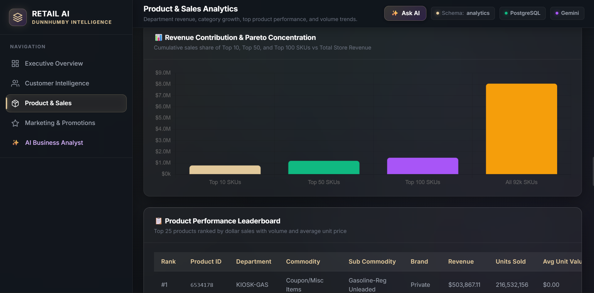
*Pareto Revenue Concentration: Revenue vs. unit volume distribution and catalog revenue concentration analysis.*

---

### 4. Marketing & Promotions

Evaluates marketing campaign effectiveness, coupon redemption behavior, promotional channel lift, and customer segment responsiveness across historical marketing initiatives.

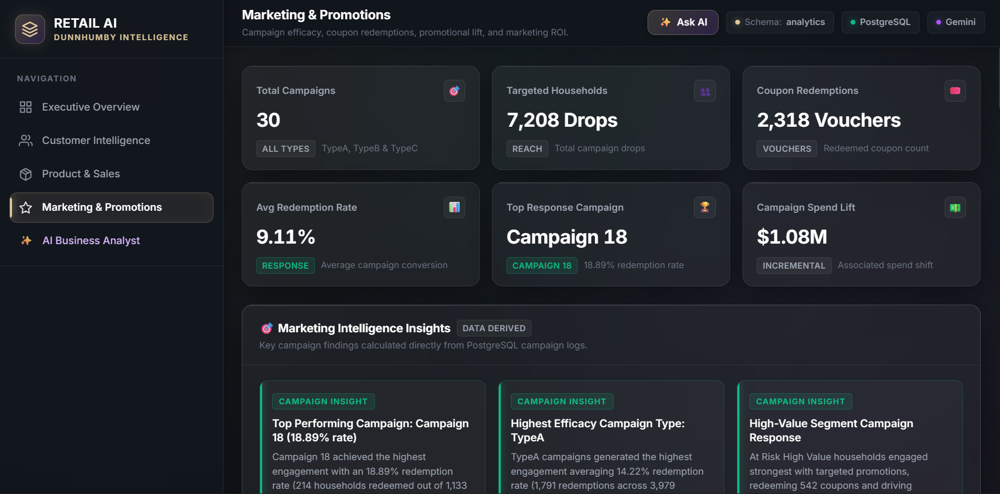
*Marketing & Promotions Dashboard: Active campaign KPIs, coupon redemption metrics, and campaign type effectiveness.*

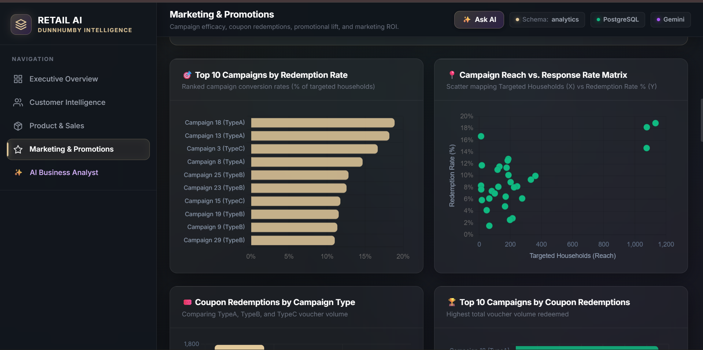
*Campaign & Coupon Lift Analysis: Household response rates, coupon redemption lift, and promotional ROI analysis.*

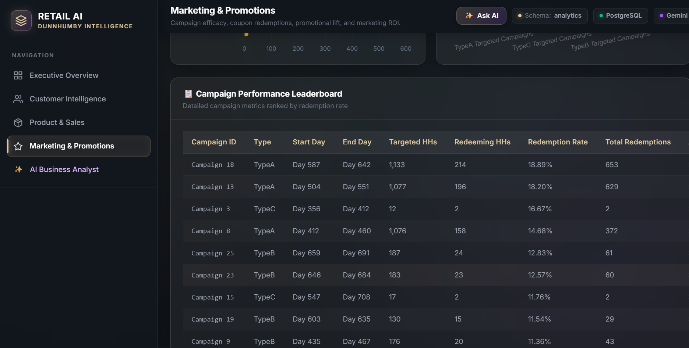
*Campaign Performance Matrix: Granular campaign rankings, reach metrics, redemption rates, and sales impact.*

---

### 5. AI Business Analyst & Decision Support

An interactive AI-powered copilot allowing stakeholders to converse with their data, inspect transparent SQL queries, and generate on-demand executive management reports.

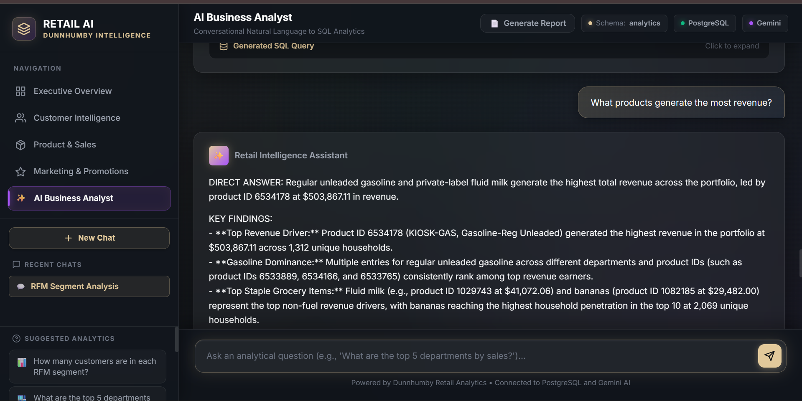
*AI Business Analyst Interface: Natural-language business question answering with context-aware responses.*

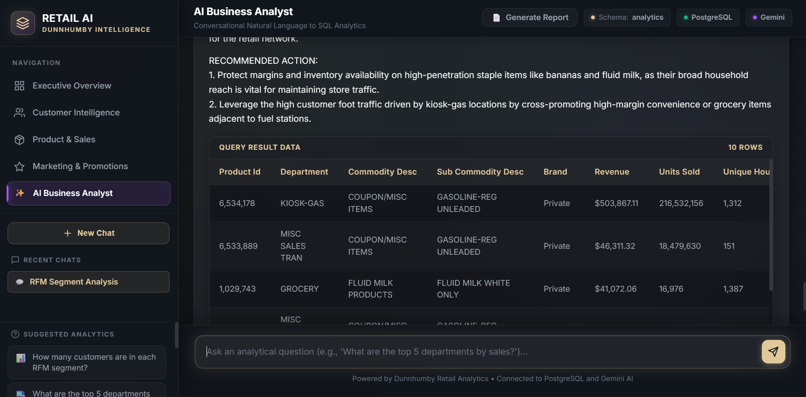
*Transparent SQL Generation: Read-only SQL query inspection and tabular query execution results.*

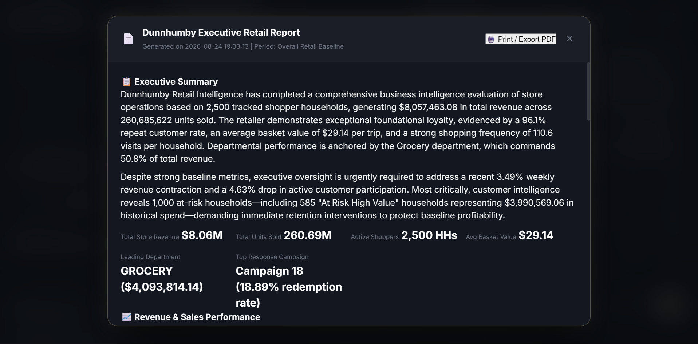
*AI Management Report: Automated multi-domain executive management report synthesizing real database metrics.*

---

## Key Features

- **Natural-Language-to-SQL (NL2SQL):** Converts complex retail business questions into syntax-valid PostgreSQL queries with dynamic schema awareness.
- **SQL Safety & Read-Only AST Validation:** Strict regex and AST guardrails ensure queries are purely read-only (`SELECT`), rejecting destructive operations (`DROP`, `DELETE`, `UPDATE`, `INSERT`, `ALTER`, etc.).
- **RFM Customer Segmentation:** Automated segmentation classifies households into *Champions*, *Loyal Customers*, *Potential Loyalists*, *At Risk High Value*, *Promising*, and *Lost Shoppers*.
- **Automated Anomaly & Insights Scanner:** Programmatically identifies statistically significant revenue shifts, margin contractions, and churn risks across analytics tables.
- **Multi-Step AI Agent:** Autonomous analytical agent capable of multi-table cross-referencing to diagnose root causes behind business metric changes.
- **Executive AI Management Report Generator:** Synthesizes real database aggregates across overview, customer, product, and marketing domains into structured executive summaries.
- **Production Data Pipeline:** Modular 6-stage SQL pipeline organizing schema definition, raw ingestion, cleaning, validation, analytics modeling, and reporting views.
- **Enterprise UI / UX:** Modern dark glassmorphism dashboard with interactive Chart.js visualizations, responsive navigation, and session-persisted conversation history.
- **Vercel Serverless Ready:** Pre-configured with `vercel.json` rewrites and Python serverless function entry points for cloud deployment.

---

## Technology Stack

| Layer | Technology | Description |
| :--- | :--- | :--- |
| **Frontend** | HTML5, CSS3, Vanilla JS (ES6+) | Custom glassmorphism design system, responsive layouts, zero heavy UI frameworks |
| **Visualizations** | Chart.js & Custom Canvas | Interactive line charts, bar charts, doughnut distributions, and scatter plots |
| **Backend API** | FastAPI (Python 3.10+) | High-throughput asynchronous REST API framework with Pydantic schema validation |
| **ASGI Server** | Uvicorn | Lightning-fast ASGI web server for local development and execution |
| **Database** | PostgreSQL 15+ | Relational data warehouse with indexing, foreign key constraints, and analytics views |
| **Database Driver** | psycopg2-binary | Low-level, thread-safe PostgreSQL database adapter for Python |
| **AI / LLM** | Google Gemini API (`google-genai`) | Gemini 2.5 Flash / Flash Lite for SQL generation and executive business synthesis |
| **Deployment** | Vercel Serverless Functions | Production deployment configuration via `vercel.json` and `api/index.py` |

---

## System Architecture

```text
┌────────────────────────────────────────────────────────────────────────┐
│                          BUSINESS STAKEHOLDERS                         │
└────────────────────────────────────┬───────────────────────────────────┘
                                     │ (Browser HTTP / JSON)
                                     ▼
┌────────────────────────────────────────────────────────────────────────┐
│                     FRONTEND PRESENTATION LAYER                        │
│   ├── Executive Overview     ├── Product & Sales Intelligence         │
│   ├── Customer Intelligence  ├── Marketing & Promotions               │
│   └── AI Business Analyst / Executive Management Report Workspace      │
└────────────────────────────────────┬───────────────────────────────────┘
                                     │ REST API Requests
                                     ▼
┌────────────────────────────────────────────────────────────────────────┐
│                        FASTAPI BACKEND LAYER                           │
│   ├── Endpoint Routers (/api/dashboard/*, /chat, /api/reports/*)       │
│   ├── CORS & Request Validation (Pydantic Models)                     │
│   └── Multi-Step Agent Orchestrator & Anomaly Detection Pipeline       │
└───────────────────┬────────────────────────────────┬───────────────────┘
                    │                                │
        (SQL Generation & Insights)         (Database Queries)
                    │                                │
                    ▼                                ▼
┌──────────────────────────────────────┐ ┌───────────────────────────────┐
│          GOOGLE GEMINI API           │ │     POSTGRESQL DATA WAREHOUSE │
│   ├── Gemini 2.5 Flash / Flash Lite  │ │   ├── Raw Ingestion Tables    │
│   ├── NL2SQL Prompt Engine           │ │   ├── Cleaned Analytics Tables│
│   └── Executive Synthesis Engine     │ │   ├── Aggregated Views (06_*) │
└──────────────────────────────────────┘ └───┬───────────────────────────┘
                                             │ (Safe Read-Only SELECT)
                                             ▼
                                 ┌───────────────────────┐
                                 │   SQL Safety Guard    │
                                 │ (Read-Only AST Filter)│
                                 └───────────────────────┘
```

---

## AI Analytical Workflow

The natural-language-to-SQL copilot operates under strict data governance and validation guardrails:

```text
[ Business User Question ]
            │
            ▼
[ Context & Schema Injection ] ─── (Tables, Column Dictionaries & Relationships)
            │
            ▼
[ Gemini LLM Prompt Synthesis ] ── (Generates targeted analytical SQL query)
            │
            ▼
[ SQL Safety & Security Filter ]
   ├─ Checks for read-only SELECT
   ├─ Blocks destructive keywords (DROP, DELETE, UPDATE, INSERT, ALTER, TRUNCATE, etc.)
   └─ Enforces query execution timeout & LIMIT caps
            │
            ▼
[ PostgreSQL Query Execution ] ─── (Executes safely against PostgreSQL analytics tables)
            │
            ▼
[ Result Validation & Formatting ] (Validates row counts, nulls, and data types)
            │
            ▼
[ Gemini Business Interpretation ] (Translates numbers into executive insights & recommendations)
            │
            ▼
[ Structured Dashboard Response ] (Returns formatted business answer, findings, SQL & data table)
```

---

## Database Pipeline & Data Lifecycle

The SQL database warehouse lifecycle is organized into 6 modular, version-controlled stages located under the `sql/` directory:

```text
sql/
├── 01_schema/       ──> Creates schemas ('raw', 'analytics') and base table DDL definitions
├── 02_ingestion/    ──> Ingests raw CSV records and verifies ingestion row counts
├── 03_cleaning/     ──> Standardizes datatypes, handles nulls, normalizes household/product records
├── 04_validation/   ──> Runs automated QA checks: null checks, duplicates, FK constraints & ranges
├── 05_analytics/    ──> Computes RFM customer cohorts, revenue aggregations & promotion lifts
└── 06_views/        ──> Materializes performant executive views consumed directly by the FastAPI backend
```

---

## Repository Structure

```text
ai-powered-ecommerce-analytics-decision/
├── .env.example                               # Sanitized environment variable template
├── .gitignore                                 # Git exclusion rules (secrets, venv, datasets, caches)
├── AI_ARCHITECTURE.md                         # Detailed AI agent & prompt engineering documentation
├── API_DOCUMENTATION.md                       # Comprehensive REST API endpoint reference
├── BUSINESS_CASE_STUDY.md                     # Business problem formulation, ROI & methodology study
├── DATABASE_DOCUMENTATION.md                  # Database dictionary, schema diagrams & ER definitions
├── README.md                                  # Main project documentation & portfolio showcase
├── TECHNICAL_DOCUMENTATION.md                 # Full technical implementation & architecture guide
├── TEST_CHECKLIST.md                          # Quality assurance & validation checklist
├── TEST_REPORT.md                             # End-to-end testing verification results
├── dunnhumby - The Complete Journey User Guide.pdf # Dataset source reference documentation
├── requirements.txt                           # Python project dependencies
├── vercel.json                                # Vercel serverless deployment routing configuration
│
├── api/
│   └── index.py                               # Vercel serverless function entrypoint
│
├── backend/
│   ├── __init__.py                            # Package initialization
│   ├── agent.py                               # Autonomous multi-step business analyst agent
│   ├── ai.py                                  # Google Gemini client configuration & fallback logic
│   ├── customers_data.py                      # Customer Intelligence analytics aggregation service
│   ├── database.py                            # PostgreSQL connection pool & health diagnostics
│   ├── insights.py                            # Automated anomaly detection & insight scanner
│   ├── main.py                                # FastAPI app initialization, middleware & routes
│   ├── marketing_data.py                      # Marketing & promotion analytics aggregation service
│   ├── overview.py                            # Executive Overview analytics aggregation service
│   ├── pipeline.py                            # Background analytics pipeline runner
│   ├── products_data.py                       # Product & Sales analytics aggregation service
│   ├── prompts.py                             # Guardrailed system prompts & few-shot SQL examples
│   ├── reports.py                             # Executive Management Report generator
│   └── sql_agent.py                           # NL2SQL translation, execution & validation engine
│
├── docs/
│   ├── AI workflow diagram.png                # AI workflow architecture diagram
│   ├── ER diagram.png                         # PostgreSQL Entity-Relationship diagram
│   ├── software architecture diagram.png      # End-to-end software architecture diagram
│   └── screenshots/                           # Curated dashboard portfolio screenshots (15 files)
│       ├── 01-executive-overview-dashboard.png
│       ├── 02-executive-overview-trends.png
│       ├── 03-executive-overview-breakdown.png
│       ├── 04-customer-intelligence-overview.png
│       ├── 05-customer-segments.png
│       ├── 06-customer-actions.png
│       ├── 07-product-sales-overview.png
│       ├── 08-product-category-performance.png
│       ├── 09-product-revenue-concentration.png
│       ├── 10-marketing-promotions-overview.png
│       ├── 11-campaign-coupon-performance.png
│       ├── 12-campaign-performance-table.png
│       ├── 13-ai-business-analyst-chat.png
│       ├── 14-ai-business-analyst-sql.png
│       └── 15-ai-executive-report.png
│
├── frontend/
│   ├── ai.html                                # AI Business Analyst interactive workspace
│   ├── app.js                                 # AI Chat client logic & session storage manager
│   ├── customers.html                         # Customer Intelligence dashboard page
│   ├── customers.js                           # Customer Intelligence charts & table rendering
│   ├── index.html                             # Executive Overview dashboard page
│   ├── marketing.html                         # Marketing & Promotions dashboard page
│   ├── marketing.js                           # Marketing dashboard charts & table rendering
│   ├── overview.js                            # Executive Overview charts & KPI rendering
│   ├── products.html                          # Product & Sales dashboard page
│   ├── products.js                            # Product dashboard charts & table rendering
│   ├── report.js                              # AI Executive Report generation & modal renderer
│   └── style.css                              # Enterprise glassmorphism stylesheet & CSS design tokens
│
├── scripts/
│   └── import.py                              # CSV-to-PostgreSQL automated ETL ingestion script
│
└── sql/
    ├── 01_schema/
    │   ├── create_schema.sql                  # Schema initialization
    │   ├── create_raw_tables.sql              # Raw ingestion table DDL
    │   └── create_analytics_tables.sql        # Cleaned analytics table DDL
    ├── 02_ingestion/
    │   ├── load_raw_data.sql                  # PostgreSQL COPY commands
    │   └── verify_row_counts.sql              # Ingestion row-count verification
    ├── 03_cleaning/
    │   ├── clean_campaigns.sql                # Campaign data cleaning
    │   ├── clean_households.sql               # Demographic data cleaning
    │   ├── clean_products.sql                 # Product catalog data cleaning
    │   ├── clean_transactions.sql             # Transaction records cleaning
    │   └── cleaning_summary.sql               # Cleaning execution summary
    ├── 04_validation/
    │   ├── data_quality_report.sql            # Master data quality report
    │   ├── validate_duplicates.sql            # Primary key duplicate checks
    │   ├── validate_foreign_keys.sql          # Referential integrity checks
    │   ├── validate_nulls.sql                 # Critical column null checks
    │   └── validate_ranges.sql                # Numeric range & logic validation
    ├── 05_analytics/
    │   ├── customer_analysis.sql              # Customer cohort analysis
    │   ├── product_analysis.sql               # Product performance queries
    │   ├── promotion_analysis.sql             # Promotional lift queries
    │   ├── revenue_analysis.sql               # Periodic revenue queries
    │   └── rfm_analysis.sql                   # RFM scoring & segmentation logic
    └── 06_views/
        ├── customer_intelligence.sql          # View for customer dashboard
        ├── executive_overview.sql             # View for executive overview
        ├── marketing_promotions.sql           # View for marketing dashboard
        └── product_sales.sql                  # View for product sales dashboard
```

---

## Environment Configuration

Create a local `.env` file in the project root directory based on `.env.example`:

```bash
cp .env.example .env
```

Configure your environment variables:

```ini
# Google Gemini API Configuration
GEMINI_API_KEY=your_gemini_api_key_here
GEMINI_MODEL=gemini-flash-lite-latest

# PostgreSQL Database Configuration
DB_HOST=localhost
DB_PORT=5432
DB_NAME=dunnhumby_retail
DB_USER=postgres
DB_PASSWORD=your_postgres_password_here

# Server & CORS Configuration (Optional)
PORT=8000
ALLOWED_ORIGINS=http://localhost:3000,http://127.0.0.1:3000
```

> [!IMPORTANT]
> **Never commit your `.env` file or API keys to GitHub.** `.env` is strictly protected in `.gitignore`.

---

## Local Setup & Installation

### Prerequisites

- **Python 3.10+** installed
- **PostgreSQL 14+** installed and running locally
- **Google Gemini API Key** ([Get one from Google AI Studio](https://aistudio.google.com/))

### 1. Clone the Repository

```bash
git clone https://github.com/beaaditya/ai-powered-ecommerce-analytics-decision.git
cd ai-powered-ecommerce-analytics-decision
```

### 2. Create and Activate Virtual Environment

**Windows PowerShell:**
```powershell
python -m venv .venv
.venv\Scripts\Activate.ps1
```

**macOS / Linux:**
```bash
python3 -m venv .venv
source .venv/bin/activate
```

### 3. Install Python Dependencies

```bash
pip install -r requirements.txt
```

### 4. Database Setup & Ingestion

1. Create a PostgreSQL database named `dunnhumby_retail`.
2. Execute the schema definitions:
   ```bash
   psql -U postgres -d dunnhumby_retail -f sql/01_schema/create_schema.sql
   psql -U postgres -d dunnhumby_retail -f sql/01_schema/create_raw_tables.sql
   psql -U postgres -d dunnhumby_retail -f sql/01_schema/create_analytics_tables.sql
   ```
3. Run the automated data pipeline or execute cleaning and view scripts:
   ```bash
   psql -U postgres -d dunnhumby_retail -f sql/03_cleaning/cleaning_summary.sql
   psql -U postgres -d dunnhumby_retail -f sql/06_views/executive_overview.sql
   psql -U postgres -d dunnhumby_retail -f sql/06_views/customer_intelligence.sql
   psql -U postgres -d dunnhumby_retail -f sql/06_views/product_sales.sql
   psql -U postgres -d dunnhumby_retail -f sql/06_views/marketing_promotions.sql
   ```

### 5. Launch the FastAPI Backend

```bash
uvicorn backend.main:app --reload --port 8000
```
*The API interactive documentation will be available at `http://127.0.0.1:8000/docs`.*

### 6. Launch the Frontend Dashboard

In a separate terminal:
```bash
python -m http.server 3000 --directory frontend
```

Open your browser and navigate to:
```text
http://localhost:3000/
```

---

## Dataset Handling & Ingestion

This project utilizes the **Dunnhumby "The Complete Journey"** retail dataset, comprising 2 years of household-level transactions across 2,500 frequent-shopper households:

- `hh_demographic.csv` — Household demographic attributes (income, household size, age)
- `product.csv` — Product catalog data (department, commodity, brand)
- `transaction_data.csv` — Detailed basket transactions (~2.6M records)
- `campaign_table.csv` & `campaign_desc.csv` — Marketing campaign participation
- `coupon.csv` & `coupon_redempt.csv` — Coupon distributions and redemption logs
- `causal_data.csv` — Store display and feature ad causal logs

> [!NOTE]
> **Dataset Exclusion Notice:** The multi-gigabyte raw CSV dataset is intentionally excluded from the Git repository via `.gitignore` to adhere to GitHub's file size policies. The repository contains the complete SQL data cleaning, validation, transformation pipelines, and ingestion script (`scripts/import.py`) required to reproduce the analytics warehouse from any standard Dunnhumby dataset download.

---

## Technical Documentation Index

Detailed technical specifications and business case documentation are available in the repository root and `docs/` folder:

| Document | Purpose |
| :--- | :--- |
| [`AI_ARCHITECTURE.md`](AI_ARCHITECTURE.md) | AI decision-support architecture, agent orchestrator, and prompt engineering guardrails |
| [`API_DOCUMENTATION.md`](API_DOCUMENTATION.md) | REST API endpoint contracts, request/response models, and status codes |
| [`BUSINESS_CASE_STUDY.md`](BUSINESS_CASE_STUDY.md) | Executive problem statement, methodology, customer cohort findings, and ROI impact |
| [`DATABASE_DOCUMENTATION.md`](DATABASE_DOCUMENTATION.md) | PostgreSQL data dictionary, relational schemas, indexing strategies, and view definitions |
| [`TECHNICAL_DOCUMENTATION.md`](TECHNICAL_DOCUMENTATION.md) | Complete architectural blueprint, component design, and integration specifications |
| [`TEST_CHECKLIST.md`](TEST_CHECKLIST.md) | QA test scenarios, edge case handling, and security test matrices |
| [`TEST_REPORT.md`](TEST_REPORT.md) | Formal validation test execution report and security audit verification |
| [`docs/ER diagram.png`](docs/ER%20diagram.png) | High-resolution PostgreSQL Entity-Relationship diagram |
| [`docs/AI workflow diagram.png`](docs/AI%20workflow%20diagram.png) | High-resolution diagram of the NL2SQL AI analytical workflow |
| [`docs/software architecture diagram.png`](docs/software%20architecture%20diagram.png) | End-to-end software architecture blueprint |
| [`dunnhumby - The Complete Journey User Guide.pdf`](dunnhumby%20-%20The%20Complete%20Journey%20User%20Guide.pdf) | Official Dunnhumby dataset documentation and data dictionary |

---

## Security & Governance

- **Zero Hardcoded Secrets:** All credentials, database passwords, and API keys are strictly loaded through environment variables.
- **Client-Side Data Hygiene:** Frontend scripts store only ephemeral chat text in `localStorage`. Zero API keys or database connection strings are exposed to the client.
- **Read-Only SQL AST Validation:** The AI SQL engine employs an Abstract Syntax Tree (AST) & regex validator that exclusively permits single `SELECT` statements, actively preventing SQL injection and data mutation.
- **CORS Protection:** Configured with explicit origin allowances for local development and production domains.

---

## Vercel Deployment Architecture

The application is structured for cloud deployment on Vercel:

```text
[ Incoming Web Request ]
           │
           ▼
     [ Vercel CDN ]
           │
           ├─► /api/*, /chat, /health, /ai/* ──► [ api/index.py (FastAPI Serverless Function) ]
           │                                                 │
           │                                                 ▼
           │                                       [ Managed PostgreSQL DB ]
           │                                       [ Google Gemini API ]
           │
           └─► /* ─────────────────────────────► [ /frontend/* (Static Web Assets) ]
```

- `vercel.json` routes all REST API requests to `api/index.py` while serving the frontend directory as static assets.
- `api/index.py` dynamically resolves Python module paths for the serverless container.

---

## Project Status

**Status: Production & Portfolio Ready**

- Comprehensive database cleaning and analytical views implemented and validated against real retail data.
- FastAPI backend, anomaly detection engine, and AI copilot tested with zero regressions.
- Frontend BI dashboard fully responsive with interactive visualizations.
- Documentation, architecture diagrams, and testing reports fully prepared for public review.

---

## Author & Acknowledgments

- **Author:** Aditya Agrawal
- **GitHub:** [@beaaditya](https://github.com/beaaditya)
- **Dataset:** Dunnhumby Retail Dataset (*The Complete Journey*)
- **License:** MIT License — Open source for academic and portfolio evaluation.
